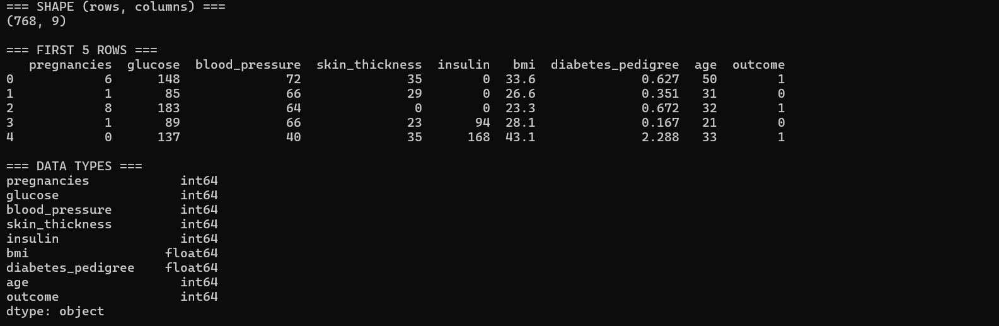
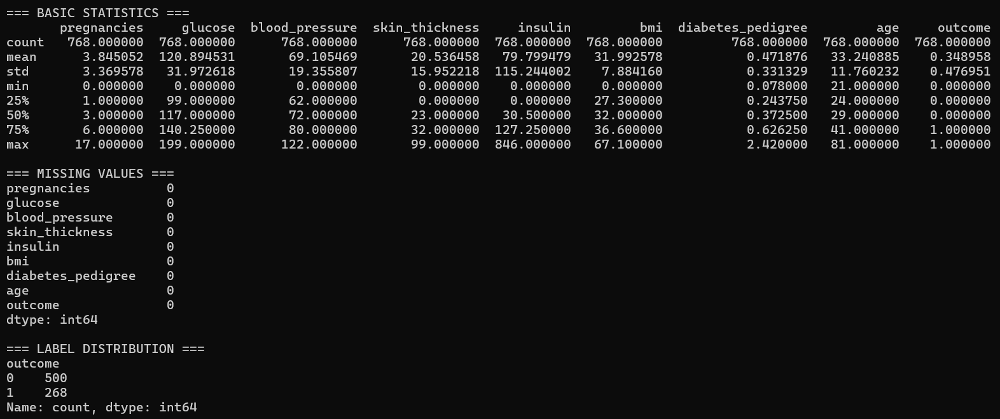
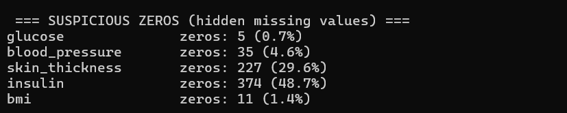

Result:
768 patients
8 features — all numeric, no text (easy to model)
Class imbalance — 65/35 split (needs handling)
Hidden missing values disguised as zeros (needs fixing)
Some extreme outliers — insulin especially (needs investigation)

This shows the count how many suspicious zeros exist per column.
